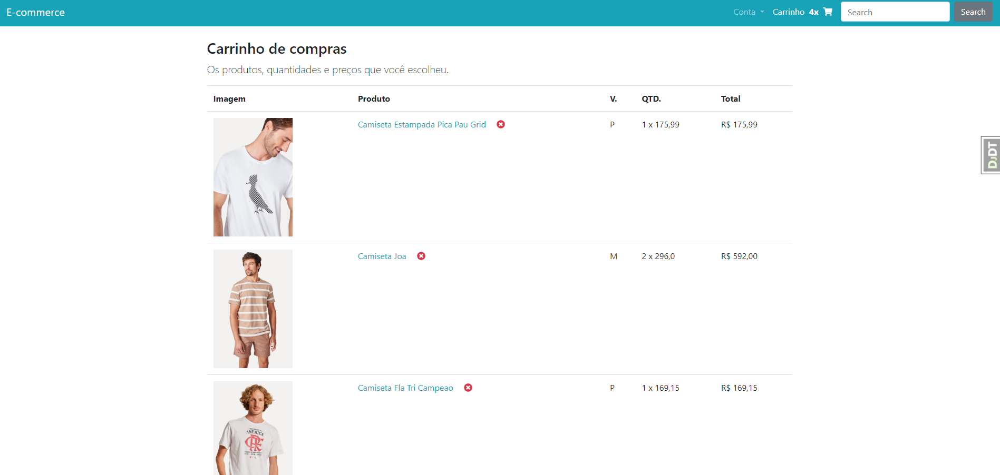
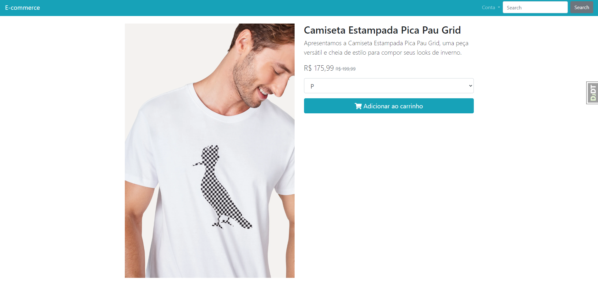
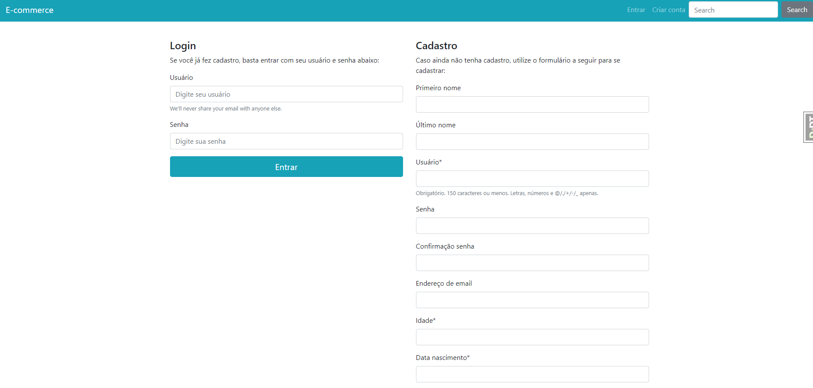
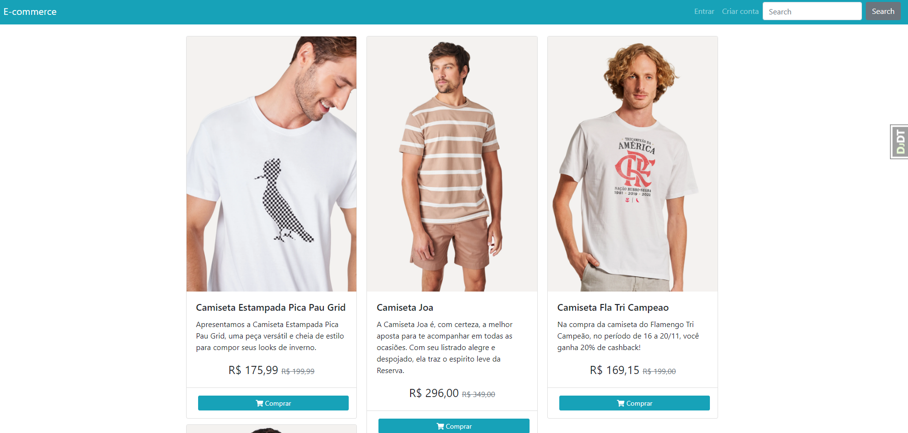

# E-commerce com Django

Este é um projeto de e-commerce desenvolvido com Django, que oferece as seguintes funcionalidades:

## Funcionalidades Principais

- **Lista de Produtos**: Exibe uma lista de produtos disponíveis para compra, com informações como nome, imagem e preço.
  
- **Carrinho de Compras**: Permite adicionar, remover e visualizar produtos no carrinho. O total de itens e o preço são atualizados dinamicamente.

- **Sistema de Autenticação**: Usuários podem criar uma conta, entrar em sua conta ou sair. Acesso à conta inclui a opção de atualizar informações.

- **Páginas de Detalhes do Produto**: Cada produto possui uma página de detalhes que fornece informações adicionais.

- **Busca de Produtos**: Usuários podem buscar produtos através de um campo de pesquisa.

- **Paginação**: A lista de produtos é paginada, facilitando a navegação entre diferentes páginas de produtos.

- **Design Responsivo**: O layout do site se adapta a diferentes tamanhos de tela, proporcionando uma boa experiência em dispositivos móveis e desktops.

## Estrutura do Projeto

- **Templates**: Utiliza o sistema de templates do Django para renderizar HTML dinâmico.
  
- **Mídia e Estilos**: Carrega arquivos estáticos (CSS, JS) e de mídia (imagens de produtos).

- **Mensagens**: Exibe mensagens de feedback para o usuário, como confirmações e erros.

## Como Executar o Projeto

1. **Instalar Dependências**: Certifique-se de que todas as dependências do Django estão instaladas.
2. **Configurar Banco de Dados**: Ajuste as configurações de banco de dados em `settings.py`.
3. **Executar Migrações**: Rode as migrações para criar as tabelas necessárias.
4. **Iniciar o Servidor**: Execute `python manage.py runserver` para iniciar o servidor de desenvolvimento.

## Tecnologias Utilizadas

- **Django**: Framework web em Python.
- **Bootstrap**: Framework CSS para design responsivo.
- **Font Awesome**: Para ícones.

## Imagens do Projeto em Funcionamento

